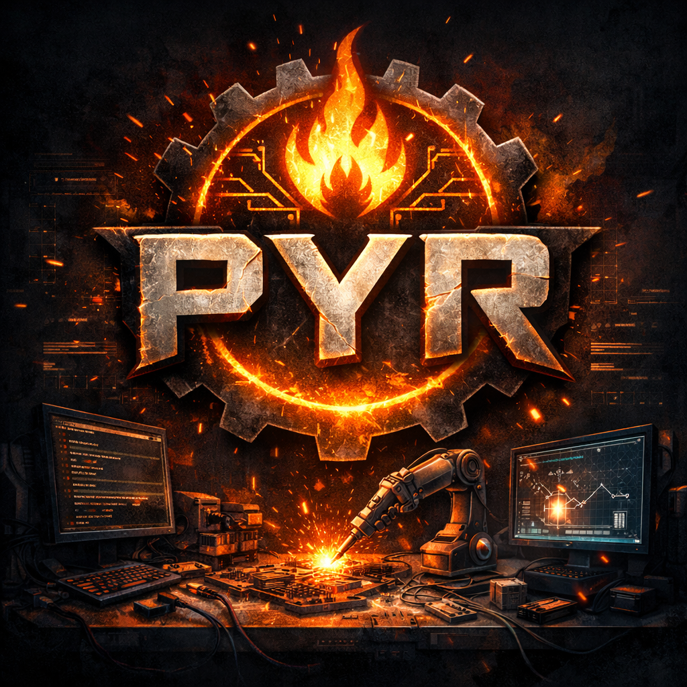

  

# PYR

PYR is a self-evolving toolcraft engine.

Instead of trying to solve everything with raw LLM reasoning, PYR builds software tools to extend its own capabilities — and then improves those tools over time.

---

## Core Idea

LLMs should not be best at doing tasks. They should be best at building tools that do tasks better than the LLM itself.
PYR treats tool creation as a first-class cognitive ability.

---

## Design Principles

- Determinism over hallucination
- Tools over prompts
- Tests before promotion
- Versioned evolution
- Sandbox execution
- Observable metrics
- Reversible changes

---

## Status

Conceptual architecture.
Experimental playground.
Not a production system.

---

## Why PYR?

Because intelligence that cannot change its environment can only repeat itself.

PYR changes its environment.
