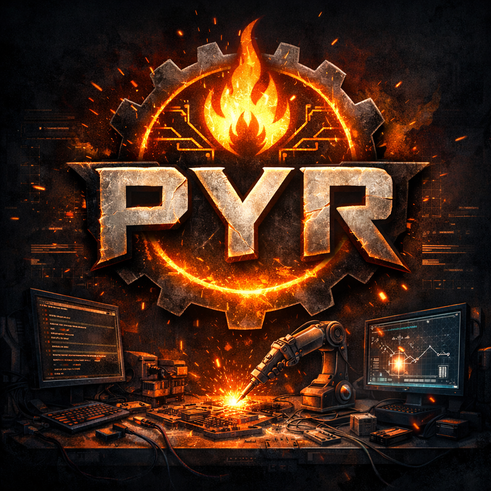

<p align="center">
  
</p>

## PYR
# PROJECT: AI-Native Narrative Game Generator (PYR)

## Overview

The goal of this project is to build an **AI-native system that generates fully playable narrative games from text prompts**, using a **custom lightweight runtime** and a **text-first data model**.

The system is designed to:

* produce **playable game builds (Windows EXE) automatically**
* be **AI-centric (Claude Code-driven)**
* avoid traditional editor-based workflows (Unity/Unreal)
* enable **rapid iteration via natural language**
* serve as a foundation for future expansion into other game genres

This is not a game engine.
This is a **game generation system + runtime + pipeline**.

---

## Core Goals

1. **Prompt → Playable Game**

   * User provides a short textual description
   * System generates a complete narrative game
   * Output: runnable Windows executable (EXE)

2. **AI-First Architecture**

   * Entire project is structured for AI generation and modification
   * No reliance on GUI editors
   * All game content is stored in structured text (YAML/JSON/DSL)

3. **Custom Lightweight Runtime**

   * Purpose-built for narrative games
   * Minimal rendering + UI + state management
   * No unnecessary general-purpose engine complexity

4. **Deterministic & Testable**

   * Game logic must be testable headless
   * Narrative flows must be automatically validated

5. **Extensible Foundation**

   * Architecture must allow future support for:

     * other narrative formats
     * systemic games
     * additional runtimes

---

## Game Design Scope (Phase 1)

Target genre:

> **Narrative-driven games with light systemic mechanics**

This includes:

* branching storylines
* dialogue systems
* player choices
* simple game systems (resources, relationships, knowledge)

---

## Core Gameplay Model ("Game Grammar")

The runtime must support the following primitives:

### 1. Scenes

* narrative units
* contain text, characters, and choices
* define transitions to other scenes

### 2. Characters

* traits (personality, role)
* relationship values (trust, suspicion, etc.)
* dynamic state (mood, knowledge)

### 3. Choices

* multiple options presented to the player
* conditional availability
* consequences applied to game state

### 4. Game State

Global and local:

* flags
* numeric variables
* story progression markers

### 5. Events

* triggered by choices or conditions
* modify game state
* transition to new scenes

---

## Systemic Layer (Light Mechanics)

The system must include:

### 1. Relationships

* values per character (e.g., trust, affection, suspicion)
* influence dialogue and branching

### 2. Resources

* money
* energy
* time (optional: day-based progression)

### 3. Inventory (Simple)

* list of items
* used for unlocking options or events

### 4. Knowledge / Clues

* discovered facts
* influence available choices

### 5. Journal

* logs:

  * discovered clues
  * important conversations
  * key events

---

## Data Model (CRITICAL)

All game content must be represented as structured text.

### Formats:

* YAML (authoring)
* JSON (runtime/build artifacts)

### Example structure:

```
/game
  /scenes
  /characters
  /systems
  /assets
  game.yaml
```

### Requirements:

* human-readable
* diff-friendly
* AI-editable
* schema-validatable

---

## AI Modules / Skills

The system is composed of multiple AI-driven modules:

### 1. Narrative Generator

* generates story structure
* creates scenes, branching paths, and pacing

### 2. Dialogue Generator

* produces character-specific dialogue
* ensures tone consistency

### 3. System Designer

* assigns variables, conditions, and mechanics
* balances relationships and resources

### 4. Asset Generator

* creates or selects:

  * background images
  * character portraits
  * UI elements

### 5. Audio Generator

* music (ambient, mood-based)
* simple sound effects

### 6. UI Generator

* layouts for dialogue, choices, HUD
* style/theme based on prompt

### 7. Game Tester (CRITICAL)

* simulates multiple playthroughs
* detects:

  * dead ends
  * unreachable content
  * broken conditions
  * pacing issues

### 8. Game Refiner

* automatically fixes issues found by tester
* improves structure and balance

---

## Runtime Requirements

The custom runtime must:

* load game definition from JSON
* render:

  * background
  * characters
  * dialogue UI
* handle:

  * input
  * choices
  * transitions
* maintain:

  * game state
  * save/load
* support:

  * deterministic execution
  * headless mode (for testing)

---

## Build Pipeline

End-to-end pipeline:

1. User prompt
2. Game spec generation
3. Content generation (story + assets)
4. Validation
5. Test simulation
6. Auto-fix iteration
7. Build packaging
8. Output:

   * Windows EXE
   * optional Web build (future)

---

## Output

* Standalone Windows executable
* Fully playable game
* No external dependencies

---

## Testing Strategy

Must include:

* automated playthrough simulation
* branch coverage
* validation rules:

  * no dead-end scenes
  * all choices lead somewhere
  * no broken references
* replay logs
* deterministic execution

---

## CLI Interface (Required)

Example commands:

```
generate-game
build-game
run-headless-tests
validate-game
package-exe
```

---

## Extensibility (IMPORTANT)

The system must be designed so that:

* runtime can be replaced
* new genres can be added
* DSL can evolve
* AI modules can be swapped or extended

Future directions:

* systemic simulation games
* coop multiplayer experiences
* 3D exploration games

---

## Initial Demo Game

The system must include a reference generation case.

### Input:

A short prompt (1–3 sentences), e.g.:

"A high school romance with a hidden mystery and multiple endings."

### Output:

* complete narrative game
* branching story
* multiple endings
* relationships and simple systems

---

## Key Principles

* AI-first, not editor-first
* data-driven, not scene-driven
* modular, not monolithic
* testable, not fragile
* playable, not theoretical

---

## Success Criteria

* system generates a playable game in under 2 minutes
* generated game is coherent and complete
* user can iterate using natural language
* system can automatically improve its own output

---
